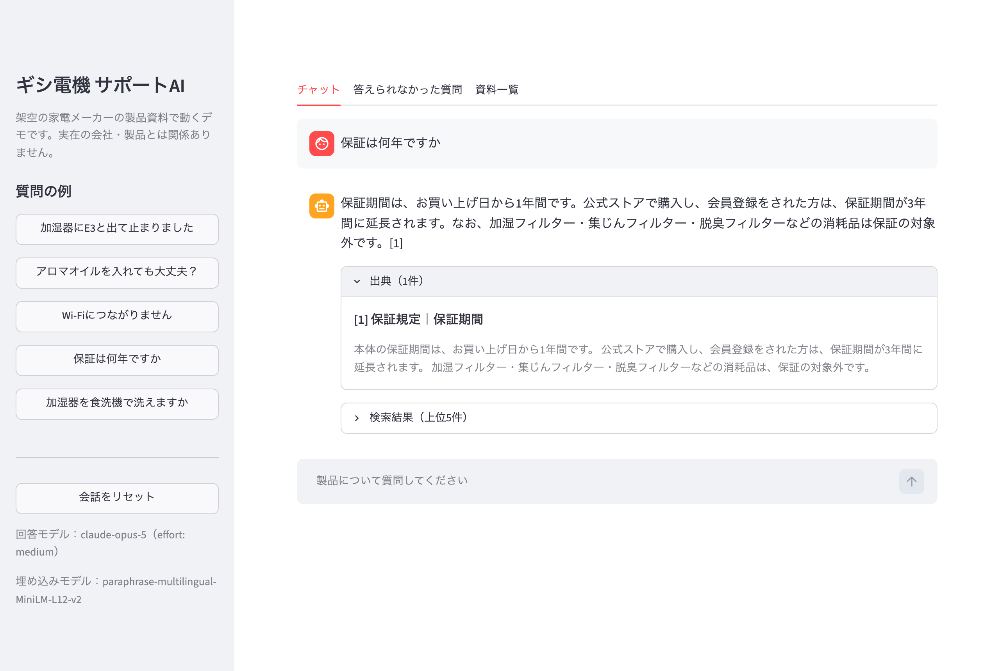
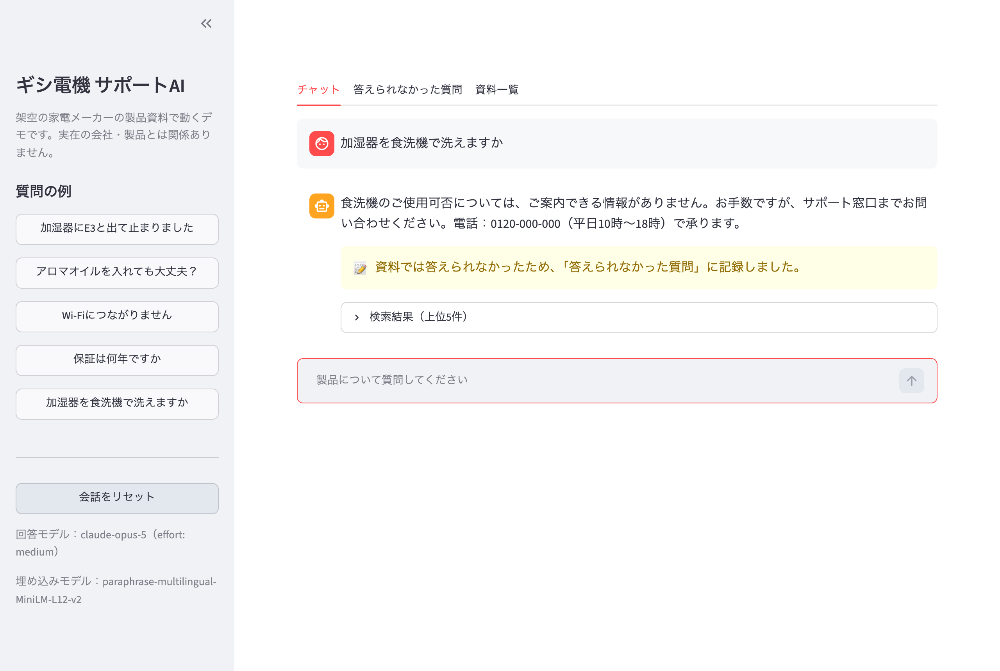
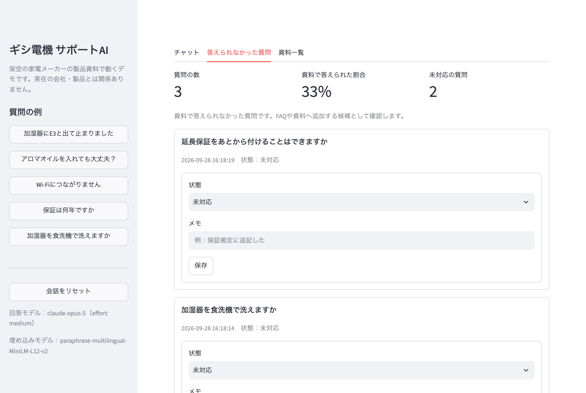
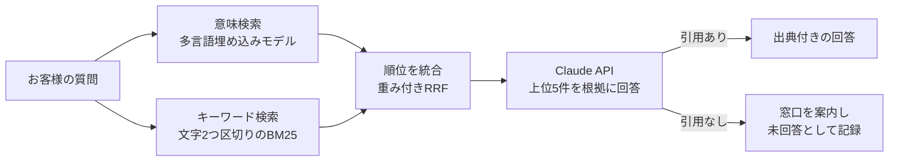

# サポートFAQ AIチャット

製品のマニュアルやFAQをもとに、お客様からの問い合わせへ**根拠付きで**答えるAIチャットです。
資料に書かれていないことは推測で答えず、有人窓口へ案内します。答えられなかった質問は記録され、FAQを増やす候補として管理画面に並びます。

> 題材は架空の家電メーカー「ギシ電機」です。資料はすべてデモ用に作成したもので、実在の会社・製品とは関係ありません。



| 資料で答えられない質問 | 答えられなかった質問の一覧 |
|---|---|
|  |  |

## 減らせる作業

- **よくある質問への一次対応**：エラー表示の意味、お手入れ方法、保証期間、送料などの質問に、資料を引いて答えます。
- **回答の確認作業**：答えには出典が付くので、担当者はどの資料のどこを根拠にしたかをすぐ確認できます。
- **FAQの改善**：資料で答えられなかった質問が一覧になるため、「次にFAQへ足すべきこと」が分かります。

## 特徴

1. **根拠を示して答える**
   回答の文ごとに [1] [2] の番号が付き、出典の資料名と該当箇所を表示します（Claude APIの引用機能を使用）。
2. **資料にないことは答えない**
   根拠が見つからない質問には、推測で答えずにサポート窓口を案内します。根拠を1つも引用しなかった回答は「答えられなかった質問」として自動で記録します。
3. **日本語に合わせた検索**
   意味で探す検索と、言葉の一致で探す検索を組み合わせています（ハイブリッド検索）。型番（HF-30）やエラーコード（E3）のような語も取りこぼしません。
4. **資料を置くだけで追加できる**
   `docs/` にMarkdownを置くと、見出しごとに区切って検索の対象になります。

## 仕組み



- 検索結果は `search_result` ブロックとしてClaude APIに渡し、APIの引用機能で出典を受け取ります。回答文を後から照合する必要がありません。
- 埋め込みモデルは手元で動く多言語モデル（ONNX）を使うため、必要なAPIキーはClaudeの1つだけです。

## 日本語検索の工夫

日本語は単語の間に空白がないため、英語向けの全文検索では語をうまく拾えません。そこで次のようにしています。

- 文章を2文字ずつに区切って（バイグラム）、キーワード検索の単位にする。
- 「にな」「てい」のような、ひらがなだけの2文字は除く。どの資料にも出てきて、関係のない資料を上位に押し上げてしまうため。
- 意味検索とキーワード検索は点数の尺度が違うので、点数ではなく順位で統合する（重み付きRRF）。

確認用の20問（「E3って出て止まった」「窓がびしょびしょになる」「HF-30の値段」など）で、20問すべてについて正解の資料が上位5件に入る設定にしています。

## 動かし方

Python 3.10以降が必要です。

```bash
git clone https://github.com/gishi-dev/support-faq-rag.git
cd support-faq-rag
python3 -m venv .venv
source .venv/bin/activate
pip install -r requirements.txt
cp .env.example .env   # ANTHROPIC_API_KEY を設定する
streamlit run app.py
```

初回起動時に、埋め込みモデル（約220MB）を `.cache/` へダウンロードします。

## ファイル構成

| ファイル | 役割 |
|---|---|
| `app.py` | 画面（チャット、答えられなかった質問、資料一覧） |
| `supportrag/loader.py` | Markdownを見出し単位に区切る |
| `supportrag/search.py` | ハイブリッド検索 |
| `supportrag/answer.py` | Claude APIでの回答生成と出典の整形 |
| `supportrag/logbook.py` | 質問と回答結果の記録（SQLite） |
| `docs/` | 架空の製品資料（14資料） |

## 自社の資料で使うには

1. `docs/` の中身を、自社のFAQやマニュアル（Markdown）に入れ替えます。`#` を資料名、`##` を項目の見出しにします。
2. `supportrag/answer.py` の `SYSTEM_PROMPT` にある会社名と窓口の案内を書き換えます。
3. 画面を開き直すと、新しい資料で検索できます。

実際に運用する場合は、社内のチャットツールやWebサイトへの組み込み、回答ログの確認手順、資料の更新フローもあわせて設計します。

## 設定

`.env` で次の値を変えられます。

| 名前 | 既定値 | 内容 |
|---|---|---|
| `ANTHROPIC_API_KEY` | （必須） | Claude APIのキー |
| `SUPPORT_RAG_MODEL` | `claude-opus-5` | 回答に使うモデル |
| `SUPPORT_RAG_EFFORT` | `medium` | 回答の考える深さ（`low`〜`max`） |
| `SUPPORT_RAG_EMBED_MODEL` | `paraphrase-multilingual-MiniLM-L12-v2` | 埋め込みモデル。`intfloat/multilingual-e5-large` も使えます（約2.1GB） |

## 謝辞

画面・検索・回答生成の構成は、[awesome-llm-apps](https://github.com/Shubhamsaboo/awesome-llm-apps) の `rag_tutorials/hybrid_search_rag`（Apache License 2.0）を出発点にしています。
日本語の資料で使えるよう、検索・回答・記録の各部分はこのリポジトリで作り直しています。

## ライセンス

[MIT License](LICENSE)
